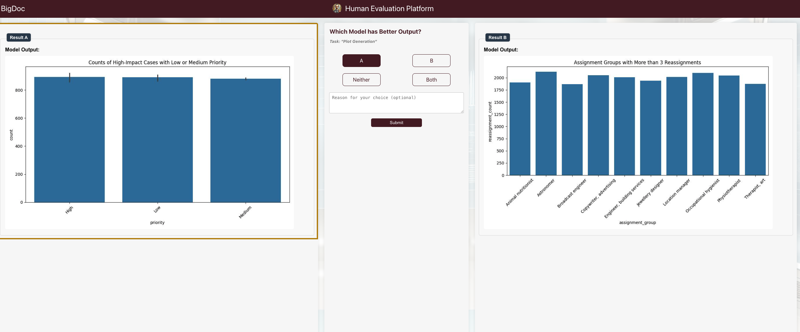

## Overview

This is a human evaluation platform that can be used to evaluate the performance between two or m models.

## 1. Quick Start

### 1. Run Web App with Sample Data

```
python app.py -m1 <path to model 1 predictions> 
              -m2 <path to model 2 predictions> 
              -t <path to tasks.json>
```

Example:

```
python app.py -m1 static/datasets/sample_model_a -m2 static/datasets/sample_model_b -t static/data/sample_tasks.json
```


### 2. Click on generated url to get an image like the one below

Choose which output you prefer from the models



### 3. Results are saved under `results/{username}/{timestamp}`

## 2. Customize the App for your Task


1. Save model_1 predictions under `static/data` similar to `static/data/sample_model_a`

2. Save model_2 predictions under `static/data` similar to `static/data/sample_model_b`

3. Save tasks key-value pairs under `static/data` similar to `static/data/sample_tasks.json`

4. **Output Card**: Change this file to include the things you want to be displayed
        `templates/text_image_card.html`

5. **Load the Predictions**: Change this file in `pred_utils.py` to load the `pred_list` where each item in the list is rendered onto the `output_card` as a dict


## 3. Host the App with a public link

```
cd ngrok
```

```
./ngrok config add-authtoken 2jC8NU59ayXQDSflA0ehk7PsE0j_2AERc6XWXR4zmABajdkWr
```

```
./ngrok http 7883
```